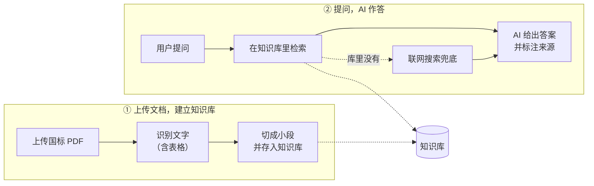

# fastrag — 防水卷材国标问答知识库

导入防水卷材类国标/行标 PDF，OCR 切块入库，混合检索后由 Agent 标来源作答，库内查不到走联网兜底。
约束与术语见 [CLAUDE.md](CLAUDE.md) / [CONTEXT.md](CONTEXT.md)，决策见 [docs/adr/](docs/adr/)，高层结构见 [docs/架构文档.md](docs/架构文档.md)。

## 架构



- **建库**：上传国标 PDF → 自动识别文字和表格 → 切成带标号、页码的小段，存进知识库。
- **作答**：用户提问 → 先在知识库里检索 → AI 用库里原文作答并标来源；库里查不到时联网搜索兜底，结果标注「来源：联网」。

## 技术栈

| 层 | 选型 |
| --- | --- |
| Agent / 编排 | Mastra（`@mastra/core` Agent + Tool、`@mastra/memory`、`@mastra/rag`、`@mastra/libsql`） |
| LLM 网关 | OpenRouter：对话 `deepseek/deepseek-v4-flash` + embedding `openai/text-embedding-3-small`（[ADR-0001](docs/adr/0001-model-routing-split.md)） |
| 向量库 / 存储 | libSQL（`@libsql/client`，本地 `file:` 文件库，向量与会话历史同库） |
| OCR | PaddleOCR-VL-1.6 托管 API，直吃 PDF，不本地渲染、不引 Python（[ADR-0003](docs/adr/0003-ocr-paddleocr-vl.md)） |
| 联网兜底 | Tavily |
| 运行时 / 工具 | Node 22 + `tsx`、AI SDK（`ai` v6）、`unpdf`、`zod` |
| 前端 | Vite + React 19 + React Router + Tailwind v4 + [ai-elements](https://elements.ai-sdk.dev/)（[ADR-0006](docs/adr/0006-ai-sdk-stream-ai-elements-ui.md)） |
| 鉴权 | 单 admin、`.env` 凭据、httpOnly 签名 cookie（[ADR-0007](docs/adr/0007-single-admin-auth-cookie.md)） |

## RAG：切片 / 向量化 / 检索

**切片**（`src/lib/indicator-chunk.ts`，[ADR-0004](docs/adr/0004-indicator-chunking-hybrid-retrieval.md)）

- OCR 出的指标表是带 `rowspan/colspan` 的 HTML `<table>`，整块嵌入会冲淡向量。先「解析网格 + LaTeX 单位归一化 + `\n` 清洗」，再**按指标行切块**。
- 每块前缀 = `标准号 + 产品名 + 表名 + 指标名` 作语义锚点（产品名从文件名提取，用户用产品名问也召得回），裸数字带着列头进向量空间。
- 表外正文走定长字符切块（`src/lib/chunk.ts`）。每块都挂元数据 `{标准号, 表名, 指标名, 页码, 状态, fileName}`，答案能标来源。

**向量化**

- 入库与检索锁同一个 embedding 模型 `text-embedding-3-small`（向量空间一致），经 OpenRouter `embedMany` 后 `upsert` 到 libSQL 向量索引 `standards`。

**检索**（`src/lib/{retrieve,hybrid,bm25}.ts`）

- **向量 + BM25 混合**：向量召回（暴力扫 `vector_distance_cos`，over-fetch 40）与 BM25 关键词召回（40）各出一路，用 **RRF**（`k=60`）融合后取 `topK=6`。
- **BM25 分词**：ASCII 按字母段/数字段成词、CJK 切相邻二元（bigram），故 `jc684`、`328.18` 也能对上库里空格写法 `JC 684-1997`。
- **元数据过滤**在内存里做（中文 key 在 libSQL filter 会报错），按 `{标准号, 表名, 指标名, 页码}` 收窄；两道护栏：过滤命中为空时自动回退裸召回，标准号归一化匹配（`jc684` ↔ `JC 684-1997`）。
- 废止标准当**普通文档**处理（[ADR-0005](docs/adr/0005-deprecated-as-normal.md)）。

## 本地部署

需要 Node 22 + pnpm。

```bash
cp .env.example .env       # 按下表填值
pnpm install
```

`.env` 关键 key（全大写）：

| key | 用途 |
| --- | --- |
| `OPENROUTER_API_KEY` | LLM：对话 + embedding |
| `PADDLE_API_KEY` | OCR |
| `TAVILY_API_KEY` | 联网兜底 |
| `ADMIN_USER` / `ADMIN_PASSWORD` / `SESSION_SECRET` | 单管理员鉴权（`SESSION_SECRET` 用 `openssl rand -hex 32`） |
| `VECTOR_DB_URL` | 可选，libSQL 库地址；不设则默认本地 `file:./vector.db` |

跑起来：

```bash
pnpm ui:build      # 构建前端到 ui/dist
pnpm start         # 起常驻服务 → http://localhost:8080（PORT= 可改）
```

浏览器打开 `http://localhost:8080`，用 `ADMIN_USER` / `ADMIN_PASSWORD` 登录，**入库 PDF、检索问答都在页面上操作**，无需命令行。

> 开发模式用 `pnpm dev`（API + vite 热更新）。向量与会话历史落在同一个本地 `vector.db`（已 gitignore），OCR 结果缓存在 `ocr_cache/`，重传不会重复付费 OCR。

线上部署在 fly.io（常驻 Node + 本地卷 libSQL），见 [ADR-0010](docs/adr/0010-deploy-fly-local-volume.md) 与 [docs/部署-fly.md](docs/部署-fly.md)。

## GitHub Actions 自动化

代码推到 `main` 分支后，`.github/workflows/deploy.yml` 会自动跑测试并部署到 fly.io，无需手动操作。只需在仓库 Settings → Secrets 配一个 `FLY_API_TOKEN`。
