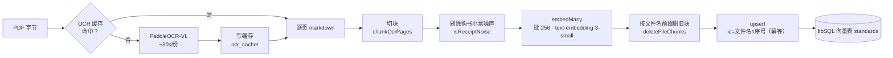
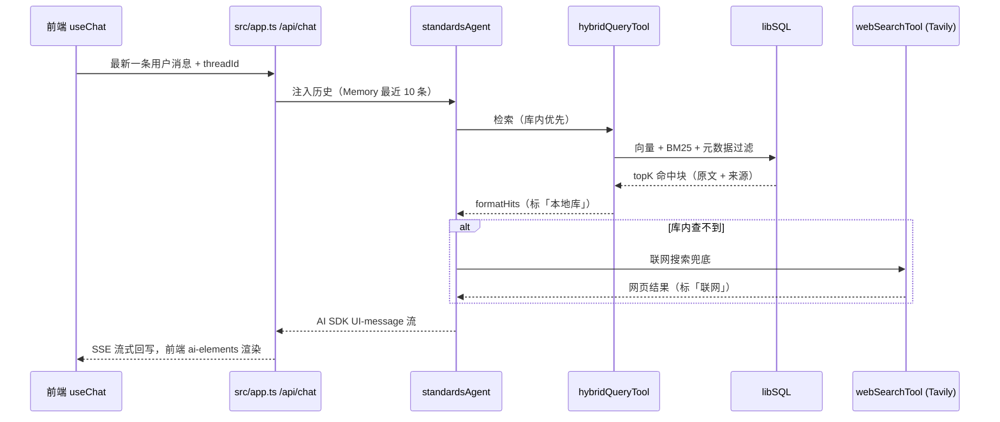
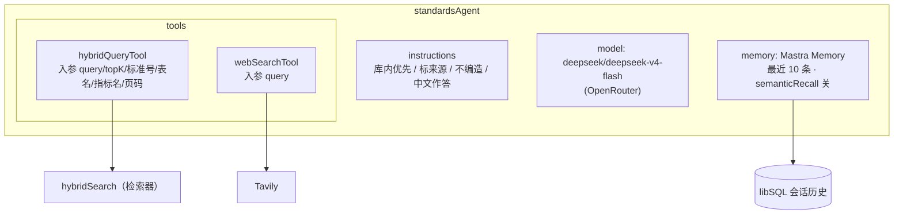
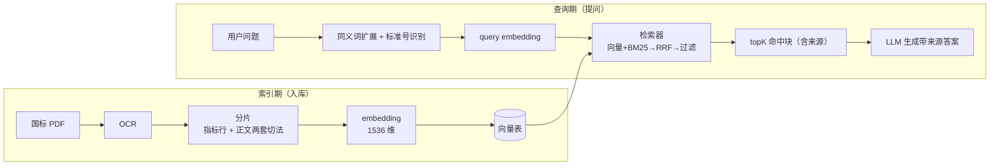
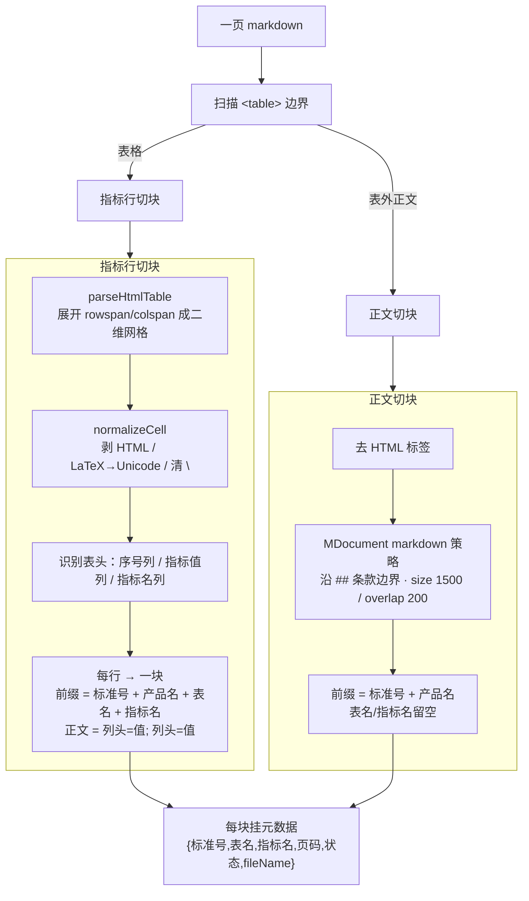
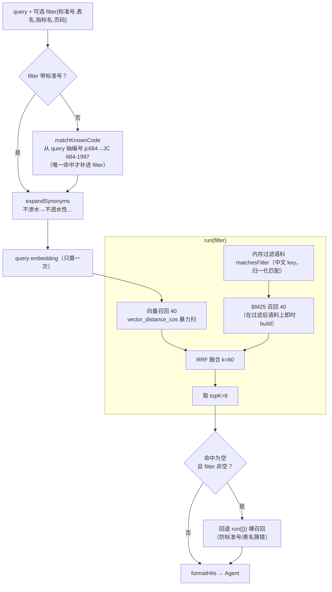
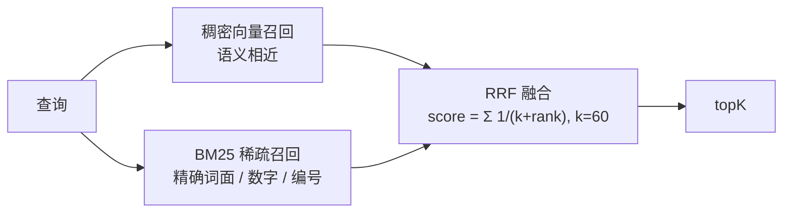

# 架构文档

> 面向开发者的技术架构。会变的细节（块数、行号）以代码为准；
> 硬约束看 [CLAUDE.md](../CLAUDE.md)，术语看 [CONTEXT.md](../CONTEXT.md)，决策看 [docs/adr/](adr/)。

## 1. 是什么

本地运行的**防水卷材国标问答库**：导入国标/行标 PDF → OCR → 切块 → 向量化入库；
提问时 Agent 混合检索、标来源作答，库内查不到走联网兜底。

技术栈：**Mastra(TS) + libSQL + OpenRouter + PaddleOCR-VL + Tavily**；前端 **Vite + React + ai-elements**。

## 2. 系统架构

后端不引 Web 框架：`src/server.ts` 起常驻 Node 进程，自带 `node:http` ↔ Web `fetch` 适配器，
路由逻辑全收口在 `src/app.ts`（同一套逻辑曾兼容 Cloudflare，故抽象出 `AppEnv` 注入外部能力）。

```mermaid
flowchart TB
  subgraph client["浏览器（ui/，Vite + React 19）"]
    UI["登录 / 入库 / 检索台\nai-elements 渲染流式回答"]
  end

  subgraph server["Node 进程 src/server.ts"]
    ADAPTER["node:http ↔ Web fetch 适配器\n（流式 SSE 回写）"]
    ROUTER["src/app.ts 路由\n/api/* + 托管 ui/dist"]
    AUTH["鉴权 auth.ts\n单 admin + 签名 cookie"]
    AGENTGRAPH["Mastra 图（懒构造单例）\nstandardsAgent + Memory + Vector"]
    INGEST["入库管线 ingest-pipeline.ts"]
    BUCKET["fs-bucket\n原始 PDF / 状态文件"]
  end

  subgraph data["本地 libSQL（单库 file:vector.db）"]
    VEC[("向量表 standards\nembedding + metadata")]
    MEM[("会话历史表\nMastra Memory")]
  end

  subgraph ext["外部服务（全经 OpenRouter / 托管 API）"]
    LLM["OpenRouter\n对话 + embedding"]
    OCR["PaddleOCR-VL\n托管 OCR"]
    WEB["Tavily\n联网搜索"]
  end

  UI <-->|"/api/*"| ADAPTER --> ROUTER
  ROUTER --> AUTH
  ROUTER -->|"/api/chat"| AGENTGRAPH
  ROUTER -->|"/api/ingest"| INGEST
  ROUTER --> BUCKET
  AGENTGRAPH --> VEC & MEM
  AGENTGRAPH --> LLM & WEB
  INGEST --> OCR & LLM
  INGEST --> VEC
```

主要路由（`src/app.ts`）：`/api/login` `/api/logout` `/api/me`、`/api/chat`、`/api/ingest` `/api/ingest/status`、`/api/library`、`/api/threads`、`/api/messages`，其余路径回退 `ui/dist`（SPA）。

## 3. 两条主流程

### 3.1 入库（离线 / 页面上传）

`src/ingest.ts`(CLI) 与 `/api/ingest`(页面) 共用 `src/lib/ingest-pipeline.ts`。

要点：OCR 结果缓存（结果 URL 仅 7 天，缓存后重切免费）；入库幂等——`id = 文件名#序号`，
重灌同名标准时先按文件名前缀整批删旧块再写新块，块数变少也不留孤儿块。

### 3.2 问答（在线）

前端只发最新一条消息，多轮上下文由服务端 Memory 按 `threadId` 还原（`GENERATE_MAX_STEPS=12`，给宽口径问题留出多次检索+生成的步数）。

## 4. Agent 架构

`standardsAgent`（`src/mastra/index.ts`）= 模型 + 两个工具 + 记忆。整张 Mastra 图懒构造、按单例缓存。

工具选择由模型按 instructions 决策：先 `hybridQueryTool` 查库（命中即以原文作答、标「来源：本地库」+标准号+页码），
完全无相关内容才 `webSearchTool` 联网（标「来源：联网」+链接）。两类来源不混淆，缺的明说「标准未列举」，不编数字。

## 5. RAG 架构

索引期与查询期**共用同一 embedding 模型** `text-embedding-3-small`（向量空间一致，硬约束③）。

## 6. 分片（Chunking）

OCR 出的 markdown 一页里混着**指标表格**（带 `rowspan/colspan` 的 HTML `<table>`）和**正文**，两者切法不同（`src/lib/indicator-chunk.ts`，[ADR-0004](adr/0004-indicator-chunking-hybrid-retrieval.md)）。

- **指标行块**：一张表按「指标行」切，裸数字带着列头进向量空间（如 `拉力 / P=600; PY=800`）。前缀里的**产品名**从文件名提取，让用户用产品名问也召得回（免手工映射表）。
- **正文块**：默认 `markdown` 策略沿国标 `## N 条款` 边界切（正文召回 84.4% > 定长 81.3%），仍挂标准号+产品名作锚点。
- **噪声过滤**：OCR 误收的购书小票/订单页（`isReceiptNoise`）入库前剔除。
- **废止标准**当普通文档处理（[ADR-0005](adr/0005-deprecated-as-normal.md)），`状态` 仍入库为数据事实，但不据它做特殊检索/作答。

## 7. 检索器（Retriever）

`hybridSearch`（`src/lib/retrieve.ts`）编排：查询预处理 → 双路召回 → RRF 融合 → 元数据过滤 → topK，
带两道护栏防空答。

设计要点：

- **向量召回**走暴力扫 `vector_distance_cos`（去 DiskANN 索引）：本库 ~1700 向量，实测 ~10ms，结果与 ANN 一致且免索引膨胀（[ADR-0009](adr/0009-drop-vector-index-bruteforce.md)）。规模涨到 10 万+ 再加回 ANN。
- **元数据过滤在内存做**：libSQL 的 filter 解析不了中文 key（报 `Invalid field key`），故 `matchesFilter` 在内存里按归一化（大小写/空格/标点无关）子串匹配。
- **护栏①**：用户没填标准号时，`matchKnownCode` 从问题里抽编号补进 filter（紧凑写法 `jc684` 也对得上库里 `JC 684-1997`）。
- **护栏②**：带 filter 却命中为空（多半是模型把标准号/表名猜错）→ 自动回退无过滤检索，靠混合召回保底，绝不空答。

## 8. 召回技术（Recall）

两路召回各补对方的短板，RRF 融合：

| 路 | 擅长 | 短板 | 本项目做法 |
| --- | --- | --- | --- |
| 向量（dense） | 语义、口语问法、近义 | 精确数字/编号/格子查找弱 | over-fetch 40，暴力扫余弦距离 |
| BM25（sparse） | 标准号、指标名、裸数字精确命中 | 不懂语义/同义 | CJK 切相邻二元、ASCII 按字母段/数字段成词，故 `jc684`、`328.18` 命中库里空格写法 |

辅助提召回：

- **同义词扩展**（`expandSynonyms`）：口语→标准术语（不渗水→不透水性），让两路都能命中标准术语命名的指标行；保守特异，避免无差别扩展引噪声。
- **标准号归一化**（`norm` + `matchKnownCode`）：小写、去空格标点后比对，跨写法对齐。
- **产品名锚点**（切块期写入）：用户用产品名问（「自粘防水卷材」）也召得回，不带号召回从 50% 提到 100%（见 `eval.ts`）。
- **RRF**（`rrfFuse`，k=60）：只用排名不用绝对分，天然抹平向量距离与 BM25 分数不同量纲的问题。

## 关键约定速查

| 约定 | 取值 | 出处 |
| --- | --- | --- |
| 对话模型 | `deepseek/deepseek-v4-flash`（OpenRouter） | [ADR-0001](adr/0001-model-routing-split.md) |
| embedding | `openai/text-embedding-3-small`，1536 维（锁死） | 硬约束③ |
| 向量召回 / BM25 召回 / topK | 40 / 40 / 6 | `retrieve.ts` |
| RRF k | 60 | `hybrid.ts` |
| 正文切块 | markdown 策略，size 1500 / overlap 200 | `ingest-pipeline.ts` |
| embed 批大小 | 256 | `ingest-pipeline.ts` |
| Memory | 最近 10 条，semanticRecall 关 | `mastra/index.ts` |
| 向量索引 | 无 ANN，暴力扫 `vector_distance_cos` | [ADR-0009](adr/0009-drop-vector-index-bruteforce.md) |
| OCR | PaddleOCR-VL-1.6 托管 API | [ADR-0003](adr/0003-ocr-paddleocr-vl.md) |
